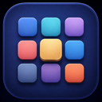
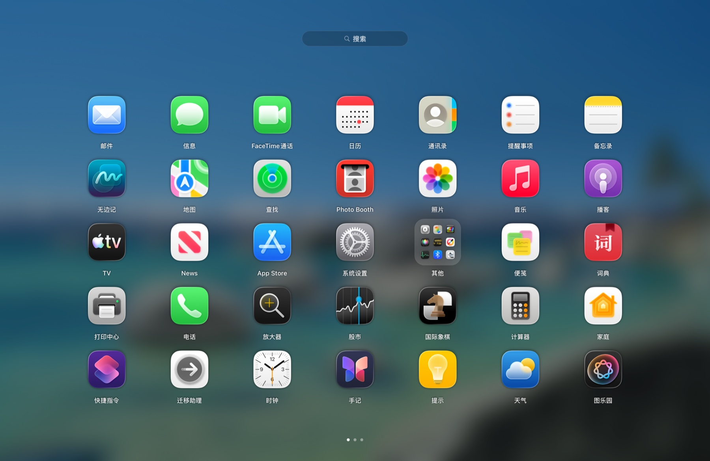
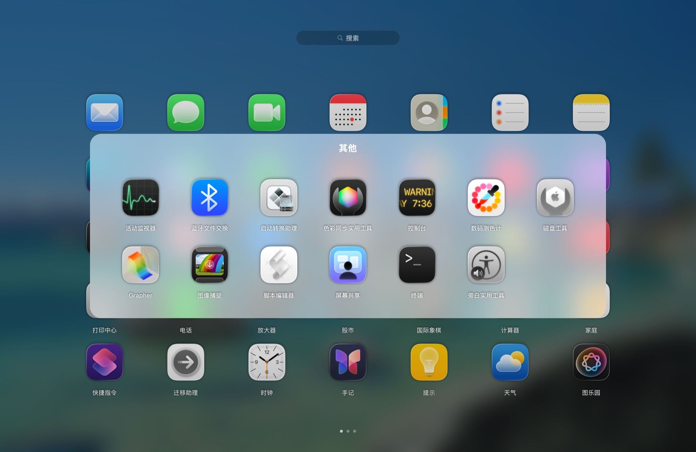
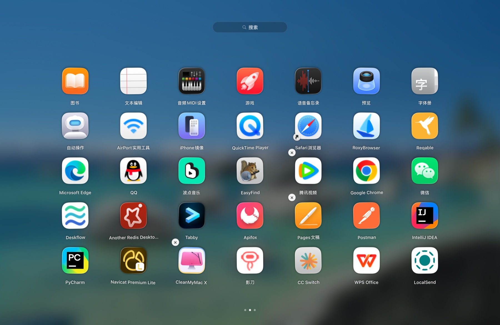
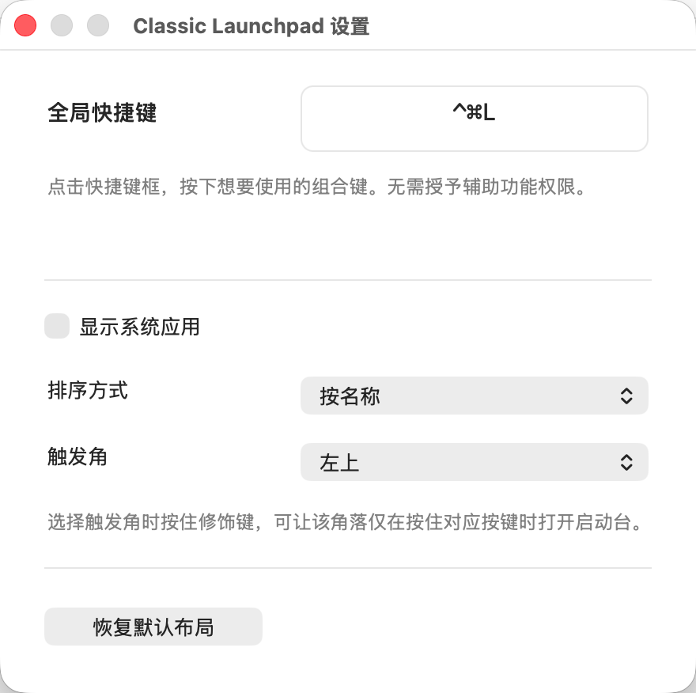

<p align="center">
  
</p>

<h1 align="center">Classic Launchpad</h1>

<p align="center">
  <strong>Bring the Launchpad you remember back to macOS 26.</strong>
</p>

<p align="center">
  A native, fluid, and fully local Launchpad recreation for macOS
</p>

<p align="center">
  <a href="README.md">简体中文</a> · <a href="README_EN.md"><strong>English</strong></a>
</p>

<p align="center">
  <a href="#download">Download</a> ·
  <a href="#highlights">Highlights</a> ·
  <a href="#controls">User Guide</a> ·
  <a href="#build-from-source">Build from Source</a> ·
  <a href="#privacy">Privacy</a>
</p>

<p align="center">
  
  
  
  
</p>

<p align="center">
  
</p>

<p align="center"><em>The familiar full-screen grid, page indicators, blurred wallpaper, and app layout.</em></p>

<a id="highlights"></a>

## ✨ Highlights

Inspired by Launchpad from macOS 15 and earlier, Classic Launchpad is built with Swift, AppKit, and Core Animation. It does not replace or modify any system component and includes no accounts, telemetry, or cloud sync.

### At a Glance

| | |
| --- | --- |
| 🔍 **Instant Search**<br>Find apps by localized name or bundle identifier. Just start typing. | 📁 **Folder Organization**<br>Stack icons into folders, rename them, reorder their contents, or move apps back out. |
| 🖱️ **Drag, Drop, and Pages**<br>Reorder within a page, drag across edges, swipe horizontally, and follow page indicators. | ⌨️ **Complete Keyboard Control**<br>Navigate with arrows, open with Return, go back with Escape, and change pages with Command + arrows. |
| 🔄 **Automatic Discovery**<br>Scans standard application locations and tracks local changes through Spotlight. | 💾 **Persistent Layout**<br>Automatically saves app order, pages, folder names, and the custom global shortcut. |
| ⚙️ **Display and Sorting**<br>Choose whether to show system apps and sort by default order, name, recently added, or a custom layout. | ◲ **Hot Corner Launch**<br>Choose a screen corner with optional modifier keys, system-conflict warnings, and support for another app’s full-screen Space. |
| ✨ **Native Visuals**<br>Builds a blurred background from the current desktop wallpaper and respects Reduce Motion. | 🗑️ **Safe Removal**<br>Only eligible Mac App Store apps can be moved to the Trash, always after confirmation. |

<a id="showcase"></a>

## 🪄 Showcase

<table>
  <tr>
    <td width="50%"></td>
    <td width="50%"></td>
  </tr>
  <tr>
    <td align="center"><strong>Folders</strong><br>Open, rename, and organize apps inside folders</td>
    <td align="center"><strong>Edit Mode</strong><br>Drag to reorder and safely remove eligible apps</td>
  </tr>
</table>

<a id="download"></a>

## 📦 Download and Install

<p align="center">
  <a href="https://github.com/Dreaming9420/Classic-Launchpad-macOS/releases/latest/download/ClassicLaunchpad.dmg"></a>
  <a href="https://github.com/Dreaming9420/Classic-Launchpad-macOS/releases/latest/download/ClassicLaunchpad.zip"></a>
</p>

The DMG is recommended: open it and drag `ClassicLaunchpad.app` into Applications. The ZIP is available for direct extraction. Visit [Releases](https://github.com/Dreaming9420/Classic-Launchpad-macOS/releases) for previous versions and release notes.

> [!IMPORTANT]
> The current packages are not signed with an Apple Developer ID or notarized. If macOS blocks the app on first launch, open System Settings → Privacy & Security, scroll to the Security section, and click Open Anyway. You only need to do this once.

### Requirements

- macOS 26.0 or later
- Apple silicon or Intel Mac
- Prebuilt packages require neither Xcode nor third-party dependencies

Classic Launchpad appears automatically after its first launch and continues running in the Dock. Press Control + Command + L to show or hide it at any time, or Command + Q to quit completely.

<a id="build-from-source"></a>

### Build from Source

Building from source requires Xcode 26.0 or later:

1. Download or clone this repository.
2. Open `ClassicLaunchpad.xcodeproj` in Xcode.
3. Select the `ClassicLaunchpad` scheme and the `My Mac` destination.
4. Press Command + R to build and run.

You can also open the project from its directory:

```bash
open ClassicLaunchpad.xcodeproj
```

<a id="controls"></a>

## 🎮 User Guide

### Common Controls

| Action | Control |
| --- | --- |
| Show or hide Classic Launchpad | Control + Command + L (customizable) |
| Change pages | Two-finger horizontal swipe, or Command + ← / → |
| Search apps | Start typing |
| Select an app or folder | Arrow keys |
| Open the selected item | Return |
| Close a folder, clear search, or dismiss Launchpad | Escape |
| Enter edit mode | Long-press an icon, or hold Option |
| Organize apps | Drag to reorder, change pages, or stack icons into a folder |
| Open Settings | Command + , |
| Quit the app | Command + Q |

Clicking the empty background or pressing the global shortcut again also dismisses Launchpad.

<a id="restore-layout"></a>

### Settings and Layout

<p align="center">
  
</p>

Settings lets you record a new global shortcut, choose whether to show system apps (enabled by default), and configure app sorting and a hot corner without granting Accessibility permission.

Sorting modes include Default Order, Name, Recently Added, and Custom. Name sorting transliterates Chinese names to Pinyin so Chinese and English names share one A–Z order. Dragging apps or editing folders switches the layout to Custom automatically. Switching from Custom to another sorting mode asks for confirmation first.

The Hot Corner menu offers Off, Top Left, Top Right, Bottom Left, and Bottom Right. Moving the pointer into the selected corner opens Classic Launchpad immediately. You can hold Command, Option, Control, or Shift while selecting a corner; once configured, Classic Launchpad opens only when you hold those keys and move the pointer into that corner. If macOS already uses the same system hot corner, Classic Launchpad asks you to disable it in Desktop & Dock settings first.

#### Restore the Default Layout

Click Restore Default Layout in Settings to reset app order, pages, and folders. This does not remove applications or change the current shortcut or macOS system settings. Restoring cannot be undone; back up `Layout.json` first if you want to preserve your current layout.

<a id="privacy"></a>

## 🔐 Local Data and Privacy

The layout and shortcut configuration are stored at:

```text
~/Library/Application Support/QitaiClassicLaunchpad/Layout.json
```

- Application scanning, Spotlight metadata access, search, and layout storage all happen locally
- The current implementation contains no network requests, user accounts, telemetry, or cloud sync

## 🧩 Under the Hood

| Area | Implementation |
| --- | --- |
| UI and animation | AppKit, Core Animation, Core Image |
| App discovery | File-system scanning, Spotlight `NSMetadataQuery` |
| Global shortcut | Carbon Hot Key API |
| Launch and removal | `NSWorkspace` |
| Local storage | Codable JSON with atomic writes |

The main source is under `ClassicLaunchpad/`. Build the complete, runnable `.app` from `ClassicLaunchpad.xcodeproj`; the included `Package.swift` is primarily intended for source checks and Swift Package Manager builds.

## 🤝 Contributing

Issues and suggestions are welcome, as are focused Pull Requests that build successfully with Xcode.

## 📄 License

This project is available under the [MIT License](./LICENSE).

## Disclaimer

Classic Launchpad is an independently developed third-party project and is not affiliated with or endorsed by Apple Inc. Apple, macOS, and Launchpad are trademarks of Apple Inc.

<p align="center"><sub>Made for people who miss the classic Launchpad.</sub></p>
